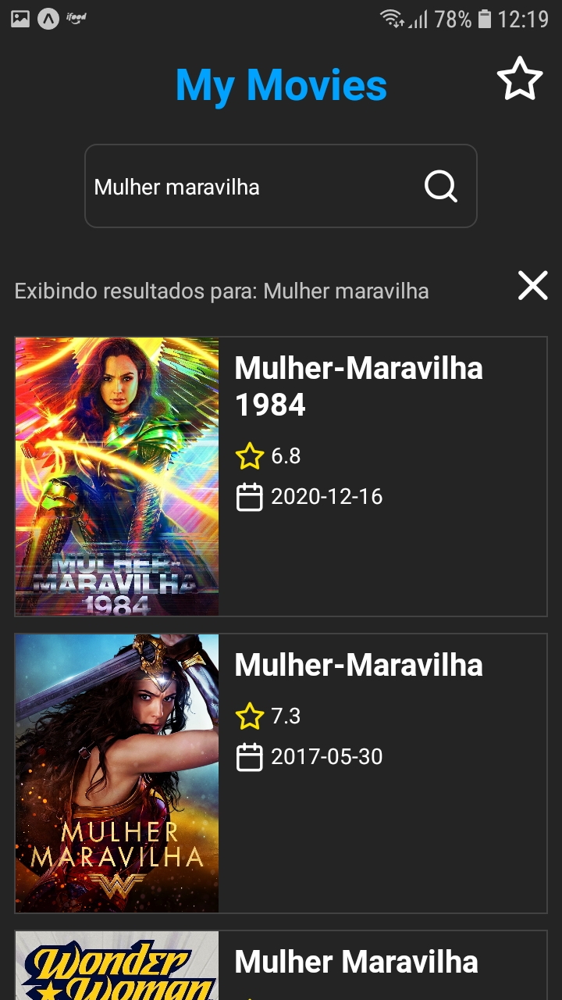
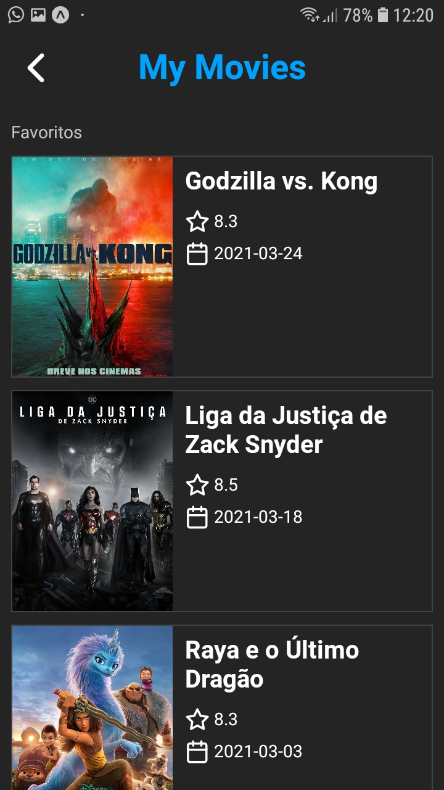

# Desafio Viitra

  
  
  
  

## Requisitos

- Buscar filmes por título utilizando a API
  - Exibir título do filme na listagem
  - Exibir tela de detalhes do filme
- Opção de adicionar filme aos favoritos
  - Exibir tela com a listagem de filmes favoritos

## 🛠 Tecnologias usadas

- Expo
- Styled Components
- Axios

## Necessário para rodar a aplicação

- Expo cli
- Aplicativo Expo instalado no dispositivo

## ⏯ Rodando a aplicação

1. Executar o comando `yarn` para instalar as dependências.
2. Executar o comando `yarn start` ou `expo start` para iniciar a aplicação.
3. Aguardar abrir uma aba no navegador com o QRCode da aplicação
4. Com o aplicativo `Expo` Scannear QRCode no navegador.
